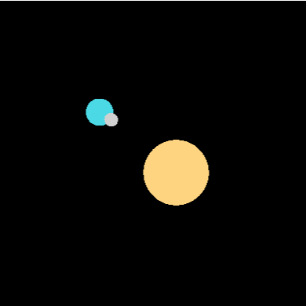

# Graphics Assignment 1

Setup assumes that you are using a UNIX-based OS with python3 and python3-venv installed.

To build the virtual environment and install necessary packages:

```bash
> make
```

To activate the virtual environment:

```bash
> source ./venv/bin/activate
```

To run the code:

```bash
> python ./src/main.py
```

or

```bash
make run
```

You should see the following output with animations:



## Buttons

* `Space`: Play or pause
* `=/+`: Increase speed
* `-`: Decrease speed
